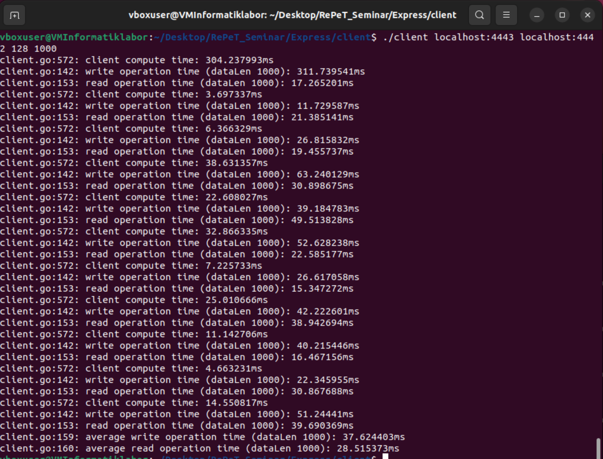
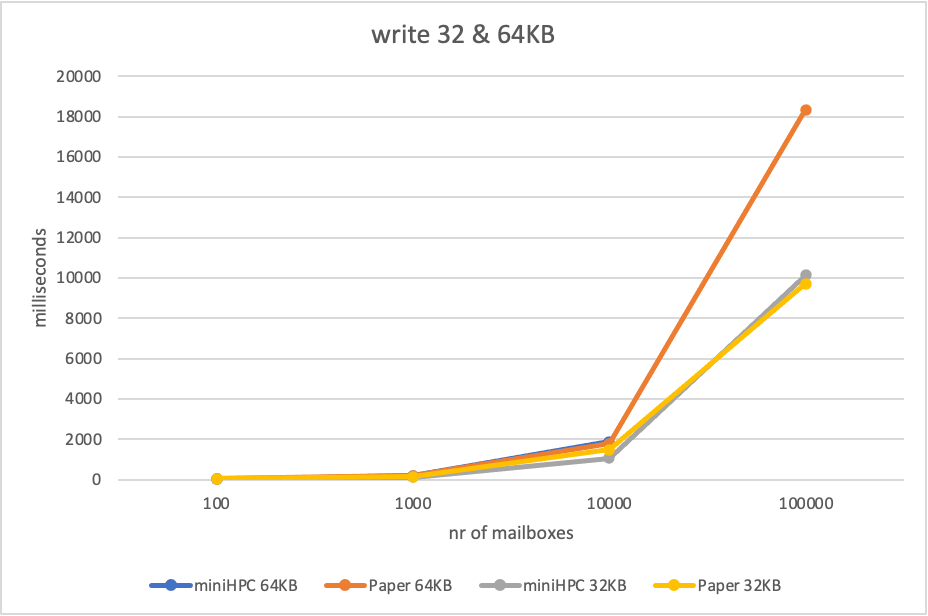
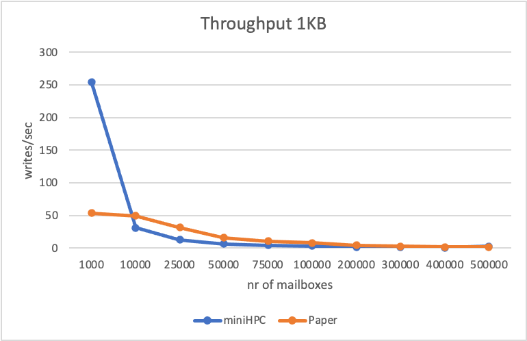

# Reproducibility of Express

Github link to original Express repository: https://github.com/SabaEskandarian/Express  
code commit hash: 3c06848bef4bfcde2fd56cb82b484bcfe5526641
 

Evaluations done on my Mac with: Processor: 1.6 GHz Dual-Core Intel Core i5  
Graphics: Intel UHD Graphics 617 1536 MB  
macOS kernel version: 23.6.0  
Additionally on the miniHPC Cluster of UniBas (https://hpc.dmi.unibas.ch/research/minihpc/)
on Intel xeon CPU


# Information about files
The following files were used for the reproduction and evaluation:
- launchLatency.sh
- launchTP.sh
- buildscript.sh
- jobscript.sh
- parseLogs.py
- results_combined.xlsl

Directories containing log files:
- logs_miniHPC: contains the generated log files when running on the HPC cluster
- logs_VM: contains the generated log files when running on the virtual machine (VirtualBox with ubuntu)
- logs_oneThread: contains the generated log files when using only one thread

## launchLatency.sh
This shell script is used to automatize the commands proposed on the github repository. The client runs a write followed by a read eleven times in a row and reports the average as well as the client computation time for each write. The script writes this output into log files, named client_nrRows_xKB.log. It is possible to run it with multiple row arguments.
Change the path CODE_DIR in the script to the path where the code is stored.  
Rows evaluated: 100, 1000, 10'000, 100'000, 500'000, 1'000'000  
Datasize evaluated: 1'000, 4'000, 16'000, 32'000, 64'000

## launchTP.sh
This script is essentially doing the same thing as launchLatency.sh, but it measures throughput, so in the command for the client 'throughput' is added to the arguments. This will cause the client to send numThreads requests in parallel as fast as it can. The total elapsed time and total number of writes processed every 10 seconds after setup will be printed into log files.
The resulting log files are called TP_nrRows_xKB.log.  
Rows evaluated for throughput 1KB: 1'000, 10'000, 25'000, 50'000, 75'000, 100'000, 200'000, 300'000, 400'000, 500'000  
Rows for 32KB: 1'000, 5'000, 10'000, 25'000, 50'000

## buildscript.sh
This file is used on the HPC cluster. The precompiled files do not work there. But there is no internet on the cluster, so we have to preinstall everything needed and then compile everything on the cluster (more details in problems).

## jobscript.sh
Script to schedule a job on the HPC cluster. Runs on a cpu with one node and 16 threads per process. Depending on which script the job should execute, change the file name in the last name after srun. The terminal output gets written into myoutput.log. The script is mostly copied from the instructions on Adam, with some parameters changed. 

I used 16 threads (argument cpu-per-task). This was the highest possible combined with the 2 Gigabyte of memory per CPU. The Readme of the github repository states that numThreads should be larger than the actual number of cores on the machine, which is the case in this settings and with the same numThreads as in the sample commands (32 for servers, 128 for client).

## parseLogs.py
This python code simplifies the evaluation of the latency. Instead of writing all the log outputs manually into one excel file, this creates an excel file. The data is written in three columns, one with the calculated average client time, one with the average write time and one with the average read time. It can be run with ```python3 parseLogs.py```

## results_combined.xlsl
Excel file that contains the result of all runs on miniHPC, on the VM and all the originial results found in the data directory in the Express repository. It was first generated with the parseLogs, and later the other results and the diagrams were added manually. 

# How to run Express code
## Initialization
Before the code is able to be used, the go mod files have to be created. For this, execute the following commands:
```console
carinafehr@carinas-air Express % go mod init express
carinafehr@carinas-air Express % go mod tidy
```
Next, build the servers and the client:
```console
cd serverA
go build
cd ../serverB
go build
cd ../client
go build
```


I used the commands stated in Express's README.md. These are:
```console
client [serverAip:4443] [serverBip:4442] [numThreads] [rowDataSize] (optional)throughput

serverA [serverBip:4442] [numThreads] [numCores (set it to 0)] [numRows] [rowDataSize]

serverB [numThreads] [numCores (set it to 0)] [numRows] [rowDataSize]
```

Brief explanation on the arguments (more detailed in Express repository):
- Port numbers (e.g. 4443) should not be changed.
- numThreads is set to 1x or 2x the number of cores on the system.
- numCores must be set to 0.
- NumRows tells the servers how many dummy mailboxes to create after one initial row is set up.
- rowDataSize sets the size of messages in bytes.
- add argument throughput to client to measure writes per second.  

Sample command for measuring throughput for 1KB messages and 1000 mailboxes (so generate 999 additional). The commands must be executed in the corresponding directories. For the client, for example, the path must end with /client:
```bash
./serverB 32 0 999 1000
./serverA localhost:4442 32 0 999 1000
./client localhost:4443 localhost:4442 128 1000 throughput
```
Screenshot of a run on the VM, measuring latency:


## Run Express on miniHPC
First, I connected via ssh to the cluster with the following command. fehr0006 is my unibas shortname:
```bash
ssh fehr0006@cl-login.dmi.unibas.ch
```
Next, I had to copy the Express code onto miniHPC with the secure copy command:
```bash
carinafehr@Carinas-MacBook-Air Express % scp -r /Users/carinafehr/RePeT_Seminar/Express fehr0006@cl-login.dmi.unibas.ch:/users/stud/f/fehr0006/
```

Additionally, I created script files and copied the content from my local laptop. All the scripts need execute permission:
```bash
nano jobscript.sh
chmod +x jobscript.sh
```
Then batch a job:
```bash
[fehr0006@dmi-cl-login ~]$ sbatch jobscript.sh
```

After everything is done on the cluster, copy the files back to the local Desktop: 
```bash 
(base) carinafehr@carinas-air Desktop % scp -r fehr0006@cl-login.dmi.unibas.ch:~/logs .
```

# Results
Here I will compare the  evaluation regarding latency and throughput. I evaluated the same parameters as the authors in their published data to be able to compare. For the "numCores" argument, they used 32 threads. The readme of the original github repository said this number should be 1x or 2x the cores of the system, and because I was not able to batch a job with 32 threads, I used 16 threads in the jobscript and also 32 threads as argument for "numThreads".

It was to be expected that the results of the VM would be much worse and significantly less meaningful than those of the miniHPC. The VM has far fewer computing resources available and is already significantly slower than the laptop itself in normal use. In addition, its performance is affected by background processes and other programs running on the Mac. These problems do not exist on the miniHPC, which is why these results are primarily considered.


Overall, my evaluation is a bit slower than the author's, but shows a similar trend in terms of increasing the number of mailboxes and message size. For both the latency and thorughput, the virtual machine produces horrible results, showing that high performance hardware is needed to realize Express.

## Latency
The average client time in Express is constant with about 20ms. When I calculated this first, it was really different in my evaluation, the average time rises fast. When looking at the results however, I saw that this is mostly due to the first entry. If this is taken out of the calculations, this changes rapidly. The average time is now also constant over different message and mailbox sizes, with about 3ms. The reason for this can be found in the Express github repository: "the first write/read are slowed down by the setup process and omitted from the average". For the averages in the excel file, I therefore also omitted the first entries. 

The write and read times being are a bit lower for small mailboxes sizes in my evaluation. For larger parameters, the time in milliseconds of my evaluation gets very close to the author's. This is probably because there is no network communication in my evaluation. Like expected, the time required for a write request is lower, the lower the message size is.  


When the number of Mailboxes becomes very large, the time for writes grows much faster than for reads, both in my and the author's evaluations. This is because Express has fast reads but expensive writes. For every mailbox one DPF has to be evaluated, so the total latency increases. 


The VM shows significantly poorer performance. It is only possible for small parameters, after that, the VM reaches its limit and freezes. It takes a lot longer for the computations, reaching over a seconds for a write request, while miniHPC still takes less than 300 milliseconds. 

For multithreading, i have not tested all combinations of mailboxes and message sizes with just one thread. The paper on Express does not mention parallelism, so this does not seem to be the most important analysis goal. It is noticeable that the average client time remains the same, but the write and read times increase due to the reduction to one thread. The write time is approximately doubled across all tests. For the read time, the difference between one and 16 threads increases the more mailboxes there are in the system. With only 100, the times are still similar, but with 100,000, they are already about four times higher with only one thread. 

## Throughput
Looking at throughput, the paper and my experiments show a similar trend. However, across all combinations of arguments, the original evaluation usually shows slightly better results. At the beginning, my evaluation is far better than the original results. This is because the calculations for a small number of mailboxes are not yet complex, and the system is therefore communication-bound. Since I am running everything on localhost, this is very fast. After that, the calculations become more complex and the system switches to computation-bound by DPF evaluation.


Comparing those results to the evaluation on the virtual machine, it is obvious that the VM performs a lot worse. With 1Kb and 25'000 messages, the VM processes less than 1 write per second (Express 31 writes). With more mailboxes, the VM freezes and needs to be restarted.

With only one thread, the throughput is much lower. The speedup achieved by the 16 threads is around 12-15. This can be seen with both 1 and 32 Kb, which shows that Express can make significantly more requests in the same amount of time. 

# Problems
### Express on MacOS
First I tried the reproducibility on my mac. But this was not possible due to a openssl version problem. The old version needed in the code is not possible anymore to download on mac (https://www.rubyonmac.dev/openssl-1-1-has-been-disabled). 
``` console
carinafehr@carinas-air serverB % brew install openssl@1.1

==> Fetching downloads for: openssl@1.1
Error: openssl@1.1 has been disabled because it is not supported upstream! It was disabled on 2024-10-24.
 ```

### Express on virtual machine
The ubuntu virtual machine reaches its limits very soon, with small message sizes and a low amount of mailboxes.
### Localhost vs different VMs
In their paper, the authors evaluated the code on three Google Cloud VMs, each with 16-core Intel Xeon (Haswell or later), 64 GB RAM, and 15.6 Gbps bandwidth, all in the same datacenter (two VMs for the two Express servers, one VM to simulate clients). I did everything on the same HPC cluster, always with localhost. The jobs on the cluster have no connection to each other, and the have no connection to the internet. But because the limiting factor is computations done locally, mostly DPF evaluations, this is not a big problem.

### Express on miniHPC
The HPC cluster uses older version of gcc and therefore, the created files are not possible to use:
```console
./client: /lib64/libc.so.6: version GLIBC_2.34' not found (required by ./client) ./client: /lib64/libc.so.6: version GLIBC_2.32' not found (required by ./client)
```
I had to build new ones, but in the job, a connection to the internet is not possible. Therefore, i did the follwing steps:
- Change to the local terminal, into the Express directory. 
- Execute command ```go mod vendor```. 
- Change back to miniHPC. 
- Execute command ```sbatch buildscript.sh```
- Everthing is created and ```sbatch jobscript.sh``` works

At the beginning, the miniHPC worked fine. When the amount of mailboxes and message sizes became much larger, errors appeared. Here the error message when testing the latency with 100'000 mailboxes and 32KB messages: 
```console
[fehr0006@dmi-cl-login ~]$ cat logs/client_99999_32KB.log 
client.go:572: client compute time: 14.438678669s
client.go:142: write operation time (dataLen 32000): 24.970573655s
client.go:153: read operation time (dataLen 32000): 6.890481119s
client.go:572: client compute time: 3.878374ms
client.go:142: write operation time (dataLen 32000): 10.451126848s
client.go:153: read operation time (dataLen 32000): 5.012194421s
client.go:572: client compute time: 4.587362ms
client.go:142: write operation time (dataLen 32000): 10.475310771s
client.go:153: read operation time (dataLen 32000): 5.164128458s
client.go:572: client compute time: 3.987243ms
client.go:142: write operation time (dataLen 32000): 10.381354996s
client.go:153: read operation time (dataLen 32000): 4.94100804s
client.go:565: EOF
client.go:566: 0
client.go:142: write operation time (dataLen 32000): 17.765223802s
client.go:321: dial tcp [::1]:4443: connect: connection refused
panic: runtime error: invalid memory address or nil pointer dereference
[signal SIGSEGV: segmentation violation code=0x1 addr=0x360 pc=0x56fc65]

goroutine 1 [running]:
crypto/tls.(*Conn).Write(0xc0000c00f0?, {0xc00001239a?, 0x2?, 0xc0000f7bb8?})
	/users/stud/f/fehr0006/go/pkg/mod/golang.org/toolchain@v0.0.1-go1.24.4.linux-amd64/src/crypto/tls/conn.go:1199 +0x45
main.readRow(0x0, {0x7ffd744c945b, 0xe}, 0xc0000185c0, 0xc000018560)
	/users/stud/f/fehr0006/Express/client/client.go:327 +0x135
main.main()
	/users/stud/f/fehr0006/Express/client/client.go:150 +0xd45

``` 
The solution to this was reducing the number of server threads, as this was also done by the authors. For 100'000 mailboxes and 16KB, 16 instead of 32 threads worked, for 32KB I had to reduce the threads even more to 4. With 64KB messages, this didn't help either. Regardless of how low the threads were set, the measurement could not be completed.


